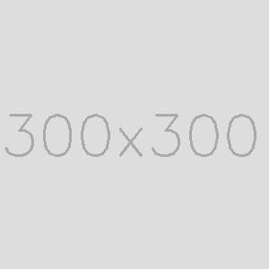
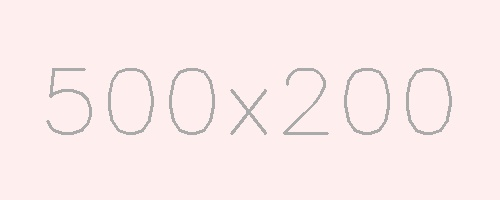

# Placeholder Image

Generate placeholder images using `OpenCV`.

## Usage

```
http://localhost:8000/{width}x{height?}{ext?}/{background?}/{foreground?}text={text?}
```

### width (required)

Width of the image, less than 10000 pixels.

- range: `[1, 9999]`
- example: `/500x200`


### height

Height of the image, if not specified, equals to width.

- default: `width`
- range: `[1, 9999]`
- example: `/300`



### ext

Image file type, `.jpg`/`.jpeg`/`.png`.

- default: `.jpg`
- example: `/400x100.png`


### background

Image background color, hex color string of 3 or 6 characters.

- default: `ddd`
- example: `/500x200/feeeee`



### foreground

Text color.

- default: `aaa`
- example: `/500x200/9bc2d4/fff`


### text

Text rendered in the center of the image.

- default: `{width}x{height}`
- language: English (ASCII characters)
- example: `/500x200/41ac52/fff?text=douban`

